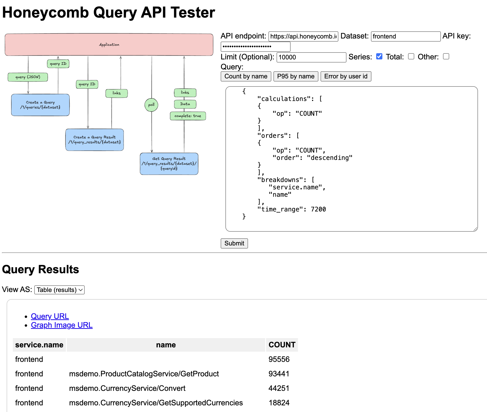

# hnyqueryapitester
Honeycomb Query API Tester for quick and easy testing of Honeycomb's query API



## How to run

```
npm run start
```

Open up your browser and visit http://localhost:3000

You must know the name of the dataset and the appropriate Honeycomb API key that has correct permision to run query.
For more information of how to manage and obtain API keys, please refer to [here](https://docs.honeycomb.io/configure/environments/manage-api-keys/). Note that you need configuration key, not the ingestion key, as ingestion keys are generally for ingesting (sending) data to Honeycomb.